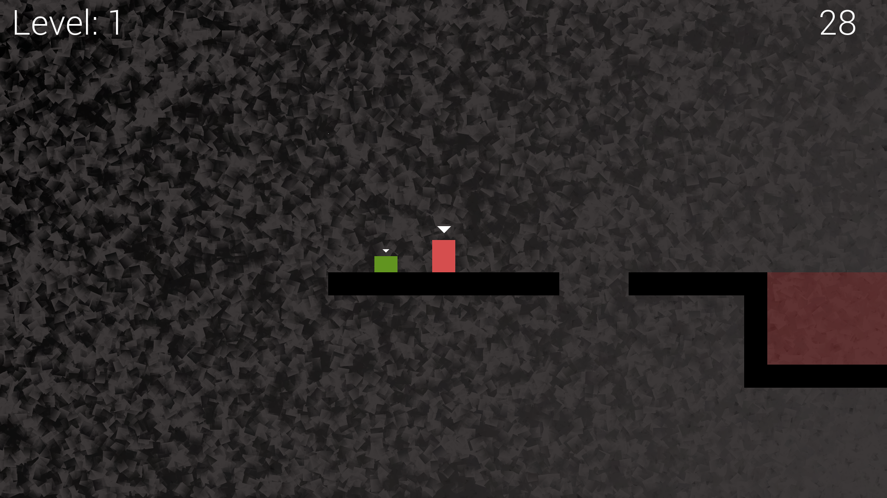
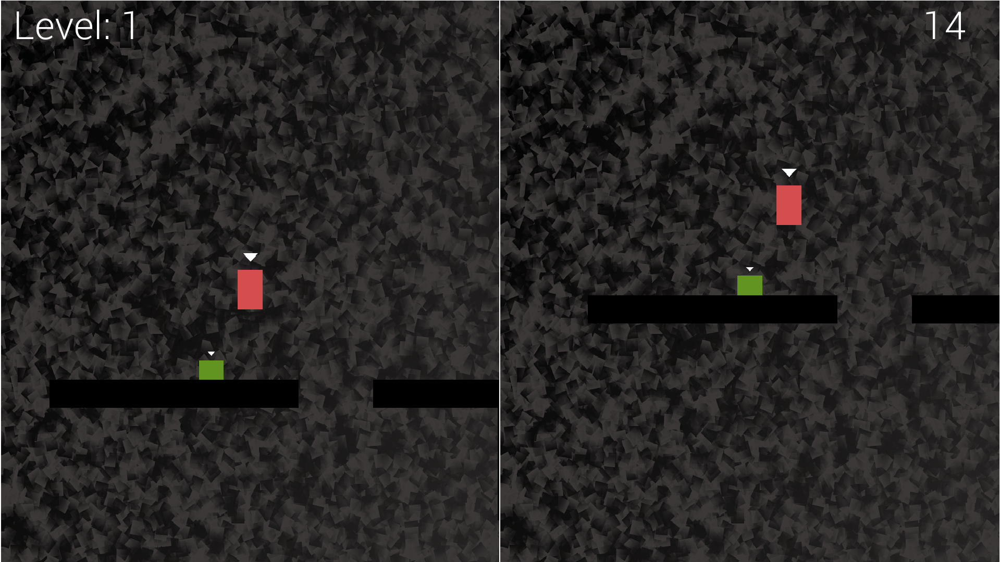
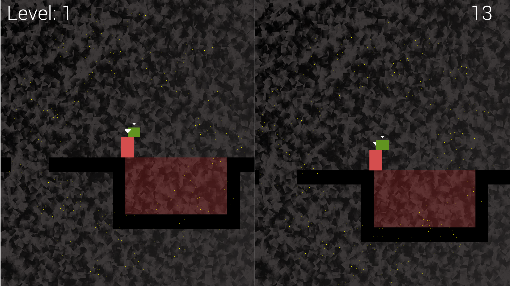

# Thomas was late por Eric

  * [Descrição](#descrição)
  * [Funcionalidades](#funcionalidades)
  * [Stack](#stack)
  * [Ferramentas](#ferramentas)
  * [Detalhes Técnicos](#detalhes-técnicos)
    + [Partículas](#partículas)
    + [Gerenciamento de texturas](#gerenciamento-de-texturas)
    + [Espacialização sonora](#espacialização-sonora)
  * [Screenshots](#screenshots)
  * [Créditos](#créditos)
  * [Licença](#licença)

## Descrição

Esse é um jogo simples de plataforma cooperativo. Nele, os dois jogadores precisam trabalhar em equipe para chegar até o objetivo antes que o tempo acabe. Esse projeto é uma versão simplificada do famoso jogo [Thomas Was Alone](https://store.steampowered.com/app/220780/Thomas_Was_Alone/), desenvolvido pelo estúdio [Bithell Games](https://store.steampowered.com/developer/BithellGames/).

## Funcionalidades
As principais funcionalidades incluem:
- Opção de tela dividida para dois jogadores
- Editor/leitor de tilemap usando arquivos .dat
- Colisão com o tilemap e entre os jogadores
- Espacialização sonora
- Partículas para efeitos na lava
- Shaders em GLSL (OpenGL Shader Language) para efeito de movimento no plano de fundo

## Stack

C++, [SFML](https://www.sfml-dev.org/), [GLSL](https://en.wikipedia.org/wiki/OpenGL_Shading_Language)

## Ferramentas
Visual Studio 2022, Git

## Detalhes técnicos

### Partículas

As partículas foram criadas utilizando uma array de vértices, que envia todas de uma vez para serem desenhadas pelo computador, o que aumenta bastante a performance do programa.

### Gerenciamento de texturas

O gerenciamento de todas as texturas no projeto é encapsulado dentro de uma classe usando o padrão *singleton*. Dessa forma é garantido que a mesma textura seja carregada apenas uma única vez. Isso evita que cada *sprite* tenha sua própria cópia da mesma textura.

### Espacialização sonora

Nesse jogo foi utilizada uma técnica de espacialização, onde o som toca em uma determinada posição dentro do mundo do jogo. Dessa forma, quanto mais o jogador se afastar da origem do som, mais baixo o som vai ficar, isso é graças a atenuação. Essa funcionalidade também tem suporte a som estéreo.

### Shaders

Também foram utilizados shaders para um efeito de "derretimento" no plano de fundo. Os shaders são separados em 2 arquivos, os arquivos de *vertex* (vertice) e *fragment* (fragmento). A diferença entre eles é que os shaders de vertices modificam o modelo ou geometria do objeto, os de fragmento modificam a cor/textura de todos os pixels.

## Screenshots

## Créditos

Esse projeto foi desenvolvido seguindo o livro [*Beginning C++ Game Programming*](https://www.amazon.com/Beginning-Game-Programming-program-building/dp/1838648577) por John Horton.

## Licença

[AGPL v3.0](https://choosealicense.com/licenses/agpl-3.0/)

